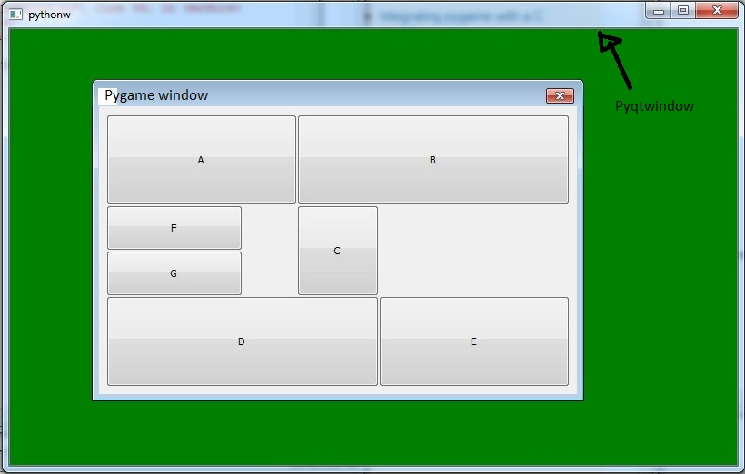

:warning: Everything between << >> needs to be replaced (remove << >> after replacing)

# EcoQuest: A Sustainability Adventure
## CS110 B1 Final Project  << Fall, 2024 >>

## Team Members

Tarah Parmar 

***

## Project Description

A Sustainability Adventure is an educational game designed to teach players about environmental sustainability while providing an engaging gaming experience. Players complete eco-friendly tasks like sorting recyclables, planting trees, and conserving energy to earn eco-points. These points are used to upgrade a virtual city into a "Green City." The game combines education, entertainment, and interactive gameplay to create a unique experience.

***    

## GUI Design

### Initial Design

### Final Design

## Program Design

### Features

1. Interactive Main Menu: This navigates options and starts the game.
2. Dynamic Gameplay: This performs eco-friendly tasks to earn points.
3. City Progression: This upgrades the city as eco-points accumulate. 
4. End State: This shows the Game Over screen after all tasks are completed. 
5. External Data: This loads tasks dynamically from an external JSON file. 

### Classes

- Player
Attributes:
name: The player’s name.
eco_points: Total points earned by the player.
Methods:
add_points(points): Adds eco-points.
reset_points(): Resets the eco-points.
- City
Attributes:
green_level: Tracks the city's sustainability progress.
Methods:
upgrade(): Increases the green level.
get_status(): Returns the current city status.
- Task
Attributes:
description: A description of the task.
points: Points awarded for completing the task.
completed: Tracks if the task is completed.
Methods:
complete(): Marks the task as completed and returns points.
- View 
Attributes:
screen: The main game screen.
font: Font for rendering text.
Methods:
draw_main_menu(): Displays the main menu.
draw_gameplay(player, city, tasks): Displays the gameplay screen.
draw_game_over(): Displays the game-over screen.
- Controller 
Attributes:
player: An instance of the Player class.
city: An instance of the City class.
tasks: A list of Task instances.
view: An instance of the View class.
Methods:
mainloop(): Runs the main game loop.
handle_events(): Handles user input.
complete_task(): Marks tasks as completed.
update(): Updates the game state.
draw(): Renders the current game state.

## ATP

Step	Procedure	Expected Results
1	Run main.py.	The main menu appears.
2	Press SPACE to start the game.	Gameplay screen is displayed.
3	Complete a task by pressing RETURN.	Task is marked as completed; eco-points added.
4	Earn 30 points and upgrade the city.	City green level increases.
5	Complete all tasks.	Game Over screen appears.
6	Press ESC during any screen.	The program exits.
